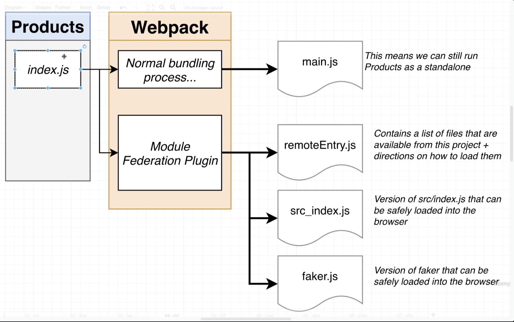
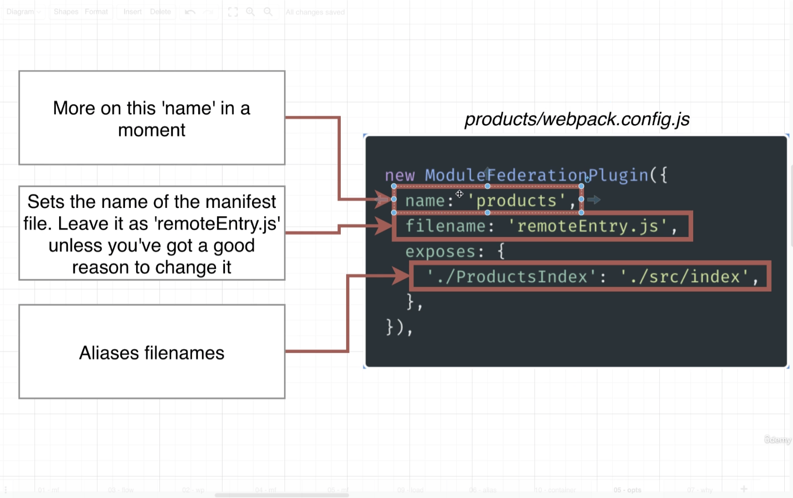
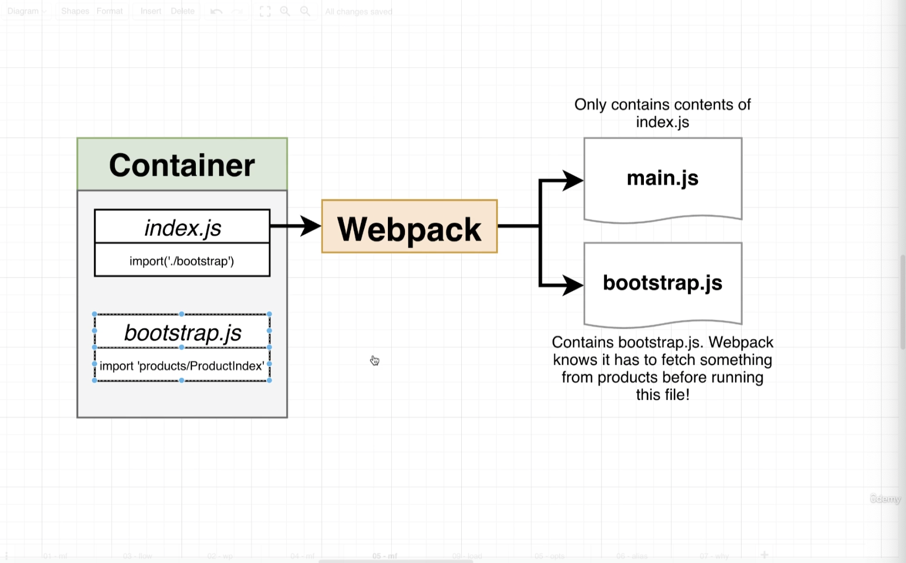
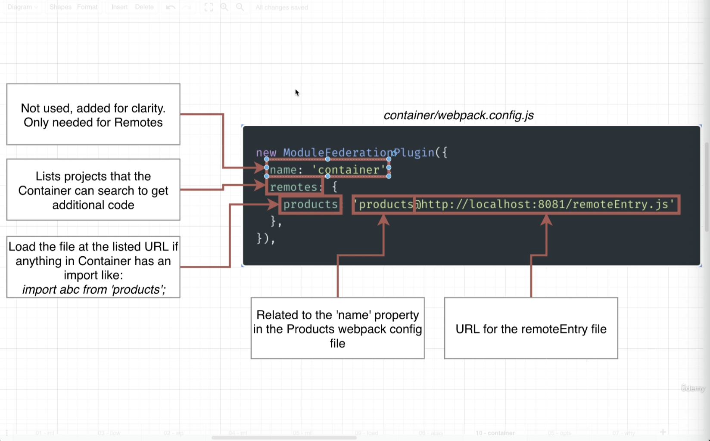
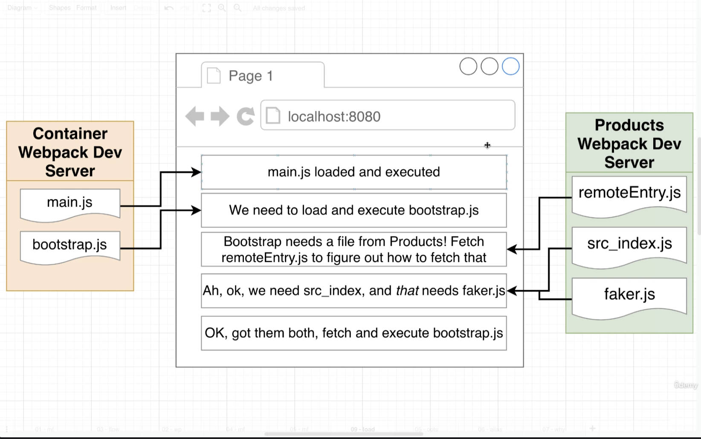
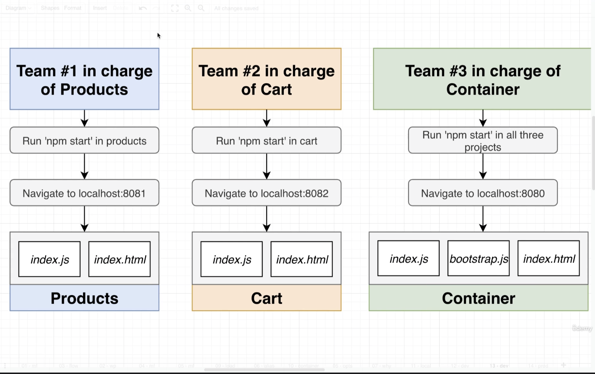
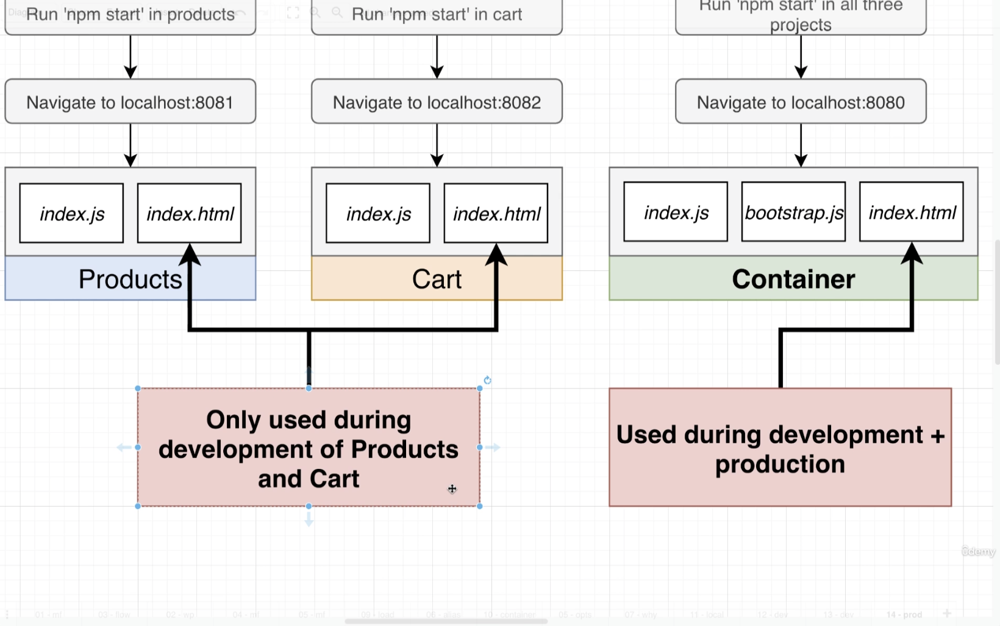

## Integration Process

- Designate one app as the Host and one as the Remote
- Host is the project that's trying to make use of code from other projects
- Remote is the project that's making code available to other projects
- In the Remote, decide which modules(files) we want to make available to other projects
- Set up Module Federation plugin to expose those modules(files)
- In the Host, decide which modules(files) we want to get from the remote
- Set up Module Federation plugin to fetch those modules(files)
- In the Host, refactor the entry point to _load asynchronously_
- In the Host, import whatever modules(files) we need from the remote

## ModuleFederationPlugin - Remote Mode

## ModuleFederationPlugin - Host Mode

## ModuleFederationPlugin - Remote + Host Flow

## Development Process

